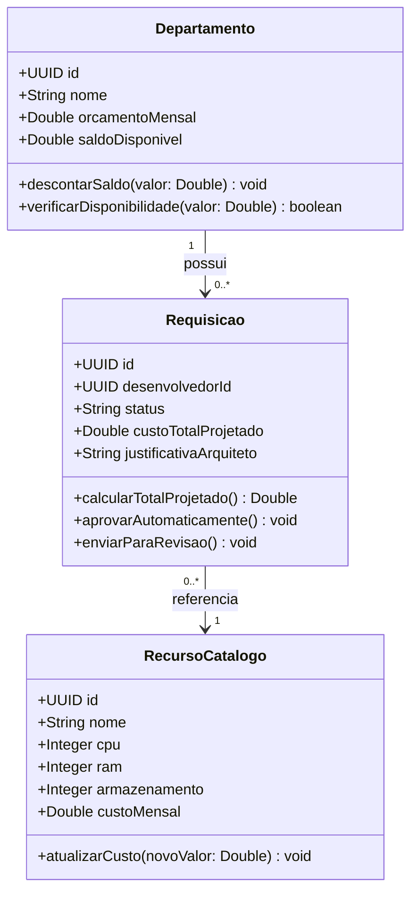

# Modelo de Domínio (FinOps)

Abaixo está a representação do modelo de domínio central do orquestrador, mapeando as entidades e suas relações em código Mermaid.

```mermaid
classDiagram
    class Departamento {
        +UUID id
        +String nome
        +Double orcamentoMensal
        +Double saldoDisponivel
        +descontarSaldo(valor: Double) void
        +verificarDisponibilidade(valor: Double) boolean
    }

    class Requisicao {
        +UUID id
        +UUID desenvolvedorId
        +String status
        +Double custoTotalProjetado
        +String justificativaArquiteto
        +calcularTotalProjetado() Double
        +aprovarAutomaticamente() void
        +enviarParaRevisao() void
    }

    class RecursoCatalogo {
        +UUID id
        +String nome
        +Integer cpu
        +Integer ram
        +Integer armazenamento
        +Double custoMensal
        +atualizarCusto(novoValor: Double) void
    }

    Departamento "1" --> "0..*" Requisicao : possui
    Requisicao "0..*" --> "1" RecursoCatalogo : referencia
```